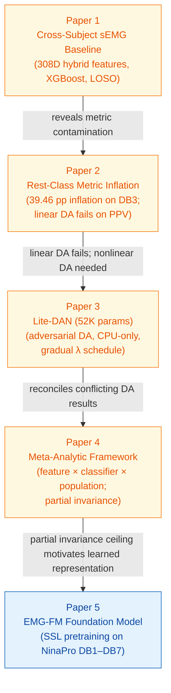

# Research Paper Series

This page documents the five-paper research programme on cross-subject
sEMG pattern recognition by Qussai Adlbi (Al-Andalus University for
Medical Sciences). The programme is structured as a single argument
across five studies: each paper identifies a limitation of the prior
step, formalises it, and resolves it.

MyoAdapt is the shared experimental substrate on which all five studies
are conducted. The platform's modules are mapped to each paper below;
the full research narrative is given in
[`research_chain.md`](research_chain.md).

---

## Dependency graph

---

## Paper 1 — Cross-subject baseline

**Title.** Cross-Subject sEMG Pattern Recognition with
Physiologically-Motivated Features

**Status.** In preparation

**Abstract.** We establish a reproducible zero-calibration cross-subject
baseline for surface-EMG gesture recognition on NinaPro DB2. A
308-dimensional hybrid feature vector per analysis window is constructed
from 22 time-domain features (including autoregressive coefficients via
Yule–Walker), 8 frequency-domain features, a 10-bin amplitude
histogram, and inter-channel correlation terms, computed per channel and
concatenated. A small CNN-1D baseline (~15K parameters) is trained on
the same windows as a deep-learning control. Under Leave-One-Subject-Out
(LOSO) cross-validation, XGBoost on the hand-crafted features
outperforms the CNN-1D baseline, inverting the within-subject
literature in which deep models typically dominate.

**Key contribution.** A reproducible, physiologically-motivated
feature representation and a CNN-1D baseline that together establish
the reference point for the rest of the series.

**Key result.** 54.64% LOSO accuracy on NinaPro DB2 with no
calibration and no domain adaptation.

**MyoAdapt modules.** `data.loaders`, `data.preprocessing`,
`data.splits.LOSOSplitter`, `features.time_domain`,
`features.frequency_domain`, `features.histograms`,
`features.correlation`, `models.classical.EMGClassifier` (XGBoost),
`models.cnn1d.CNN1D`, `evaluation.loso.LOSOEvaluator`,
`evaluation.metrics.compute_metrics`.

**Citation.**

> Adlbi, Q. *Cross-Subject sEMG Pattern Recognition with
> Physiologically-Motivated Features.* Al-Andalus University for
> Medical Sciences. In preparation.

---

## Paper 2 — Rest-class metric inflation

**Title.** Rest-Class Metric Inflation in Zero-Calibration
Cross-Subject sEMG

**Status.** In preparation

**Abstract.** We show that the overall accuracy reported in
cross-subject sEMG benchmarks is systematically inflated by the Rest
class, which dominates the label distribution and is the easiest class
to decode. Decomposing accuracy into Rest recall and active-only
accuracy on NinaPro DB2 (intact-limb) and NinaPro DB3 (transradial
amputees), we observe that on DB3 the overall accuracy of 43.46%
corresponds to an active-only accuracy of just 4.01% — a 39.46
percentage-point inflation. We further demonstrate that linear domain
adaptation methods (CORAL, TCA, Subspace Alignment) fail on MiniROCKET
PPV features because the feature covariance is near-singular
(condition number ~1e10–1e12 across kernel seeds), and that CORAL
actively worsens performance on the PPV representation.

**Key contribution.** A diagnostic metric suite (`inflation_pp`,
`rest_recall`, `active_only_accuracy`, `active_only_macro_f1`) and an
eigenvalue condition-number diagnostic that together expose a
previously unrecognised failure mode of both standard sEMG metrics and
linear domain adaptation on rank-deficient feature spaces.

**Key results.**

* DB3 overall accuracy 43.46% vs active-only accuracy 4.01% — a
  39.46 percentage-point inflation attributable to Rest-class dominance.
* CORAL, TCA, and SA fail on MiniROCKET PPV features due to
  near-singular covariance; CORAL actively worsens performance on PPV.

**MyoAdapt modules.** `evaluation.metrics.compute_metrics` (with
`inflation_pp`, `rest_recall`, `active_only_accuracy`,
`active_only_macro_f1`), `features.minirocket.MiniRocketVerifier`,
`adaptation.coral.CORALAdapter`, `adaptation.tca.TCAAdapter`,
`adaptation.sa.SAAdapter`, `evaluation.reports.ReportGenerator`.

**Citation.**

> Adlbi, Q. *Rest-Class Metric Inflation in Zero-Calibration
> Cross-Subject sEMG.* Al-Andalus University for Medical Sciences. In
> preparation.

---

## Paper 3 — Lite-DAN

**Title.** Subject-Invariant EMG Pattern Recognition via a 52K-Parameter
Lite Adversarial Network: CPU-Only Zero-Calibration Myocontrol for
Low-Resource Settings

**Status.** In preparation

**Abstract.** We introduce Lite-DAN, a domain-adversarial network
comprising a shared feature encoder feeding both a class classifier and
a domain discriminator, with a gradient reversal layer between encoder
and discriminator. The adversarial weight λ follows a gradual schedule
(0 → λ_max over the first half of training). With approximately 52K
parameters, Lite-DAN runs end-to-end on commodity CPUs — including an
Intel Celeron G5900 — and outperforms linear domain adaptation methods
on physiologically-motivated features. A three-way ablation confirms
that the gradual-λ schedule dominates fixed-λ and no-λ schedules. The
work is validated on a five-CPU benchmark spanning the Intel Celeron
G5900, Intel Core i3-10100, i5-10400, i7-10700, and AMD Ryzen 5 3600.

**Key contribution.** A CPU-only adversarial domain-adaptation
architecture with full ablation hooks (`lambda_schedule`,
`use_grl`), addressing the failure mode of linear DA exposed in
Paper 2, and a five-CPU latency benchmark confirming edge feasibility.

**Key result.** Lite-DAN outperforms linear DA on physiologically-
motivated features, runs end-to-end on CPU, and the gradual-λ schedule
is the dominant schedule choice in the ablation. The exact parameter
count varies with `n_features`, `n_classes`, `n_domains`, and
`hidden_dim`; use `LiteDAN.count_parameters()` for the exact figure
(the default config yields approximately 52K).

**MyoAdapt modules.** `models.lite_dan.LiteDAN` (with ablation hooks
`lambda_schedule='gradual'|'fixed'|'none'` and `use_grl=True|False`),
`adaptation.adversarial.AdversarialDA`,
`deployment.hardware_bench.HardwareBenchmark`.

**Citation.**

> Adlbi, Q. *Subject-Invariant EMG Pattern Recognition via a
> 52K-Parameter Lite Adversarial Network: CPU-Only Zero-Calibration
> Myocontrol for Low-Resource Settings.* Al-Andalus University for
> Medical Sciences. In preparation.

---

## Paper 4 — Meta-analytic framework

**Title.** When Does Domain Adaptation Help Cross-Subject sEMG? A
Meta-Analytic Framework Across Feature Spaces, Classifier Families, and
Population Types

**Status.** In preparation

**Abstract.** The preceding three studies report apparently
contradictory domain-adaptation results: linear DA fails on
MiniROCKET PPV features (Paper 2), but adversarial DA succeeds on
physiologically-motivated features (Paper 3). We reconcile these
findings via a meta-analysis across two axes — feature space
(physiologically-motivated hybrid, MiniROCKET PPV, raw waveform) and
classifier family (classical, CNN, adversarial) — and across two
population types (intact-limb DB2, amputee DB3). We find that linear DA
succeeds on rank-full features but fails on near-singular ones;
adversarial DA succeeds on physiologically-motivated features but does
not necessarily succeed on raw waveform; and amputee data requires
fundamentally different approaches, with DA unable to rescue Rest-class
dominance. Subject-invariant features (Rest recall ≈ 97.5%) coexist
with subject-specific features (active gestures), so partial invariance
is the norm.

**Key contribution.** A unified meta-analytic framework that
reconciles the conflicting DA results of Papers 2 and 3, and the
identification of *partial invariance* as the operative property of
cross-subject sEMG representations.

**Key results.**

1. Linear DA succeeds on rank-full features but fails on near-singular
   ones (condition number ~1e10–1e12).
2. Adversarial DA succeeds on physiologically-motivated features but
   not necessarily on raw waveform.
3. Amputee data (DB3) requires fundamentally different approaches — DA
   cannot rescue Rest-class dominance.
4. Partial invariance is the norm: Rest recall ≈ 97.5% coexists with
   subject-specific active-gesture features.

**MyoAdapt modules.** `evaluation.lodo.LODOEvaluator`,
`evaluation.statistics` (Friedman, Nemenyi, Wilcoxon + Holm–Šídák,
Hedges' g, BCa bootstrap CI), `evaluation.diagrams` (Nemenyi CD
diagram, per-fold box-plot, per-class heatmap),
`evaluation.paper_reports`, `evaluation.calibration`,
`evaluation.fairness`, `evaluation.model_card`.

**Citation.**

> Adlbi, Q. *When Does Domain Adaptation Help Cross-Subject sEMG? A
> Meta-Analytic Framework Across Feature Spaces, Classifier Families,
> and Population Types.* Al-Andalus University for Medical Sciences. In
> preparation.

---

## Paper 5 — EMG-FM foundation model

**Title.** EMG-FM: A Foundation Model for Surface Electromyography

**Status.** Planned (future work)

**Abstract.** No open-source EMG foundation model exists at the time of
writing; the only comparable effort (Yang et al. 2025) is not
open-source. We propose EMG-FM, a Transformer encoder with patch
embedding pretrained on the concatenated NinaPro DB1–DB7 corpus via
masked patch reconstruction, then fine-tuned on downstream gesture
classification. By pretraining on the full NinaPro corpus rather than
fitting per-database, EMG-FM is designed to overcome the
partial-invariance ceiling identified in Paper 4.

**Key contribution (planned).** The first open-source self-supervised
EMG foundation model, with reproducible pretraining code and (in a
later release) open pretrained weights.

**Key result (planned).** Few-shot cross-subject generalisation
exceeding the supervised Paper 1 baseline, with reduced per-subject
calibration data.

**MyoAdapt modules.** `models.emg_foundation.EMGFoundation`
(Transformer encoder with patch embedding, masked-patch-reconstruction
pretraining, supervised fine-tuning, embedding extraction),
`scripts/pretrain_emg_foundation.py`. The architecture and
pretraining loop ship with v2.0; pretrained weights on the full
NinaPro corpus are not shipped and must be regenerated by running the
pretraining script on the real `.mat` files.

**Citation.**

> Adlbi, Q. *EMG-FM: A Foundation Model for Surface Electromyography.*
> Al-Andalus University for Medical Sciences. Planned.

---

## Paper-to-module mapping (summary)

| Paper | Primary MyoAdapt modules |
|---|---|
| P1 — Cross-Subject sEMG Baseline | `features.{time_domain,frequency_domain,histograms,correlation}`, `models.classical.EMGClassifier`, `models.cnn1d.CNN1D`, `evaluation.loso` |
| P2 — Rest-Class Metric Inflation | `evaluation.metrics` (`inflation_pp`, `rest_recall`, `active_only_*`), `features.minirocket.MiniRocketVerifier`, `adaptation.{coral,tca,sa}` |
| P3 — Lite-DAN | `models.lite_dan.LiteDAN`, `adaptation.adversarial.AdversarialDA`, `deployment.hardware_bench` |
| P4 — Meta-Analytic Framework | `evaluation.lodo`, `evaluation.statistics`, `evaluation.diagrams`, `evaluation.paper_reports` |
| P5 — EMG-FM | `models.emg_foundation.EMGFoundation`, `scripts.pretrain_emg_foundation.py` |

---

## Author and contact

**Qussai Adlbi**
Al-Andalus University for Medical Sciences
Email: adlbiqussai@gmail.com
ORCID: [0009-0000-7667-1992](https://orcid.org/0009-0000-7667-1992)
GitHub: <https://github.com/Qussai-BME/MyoAdapt>
